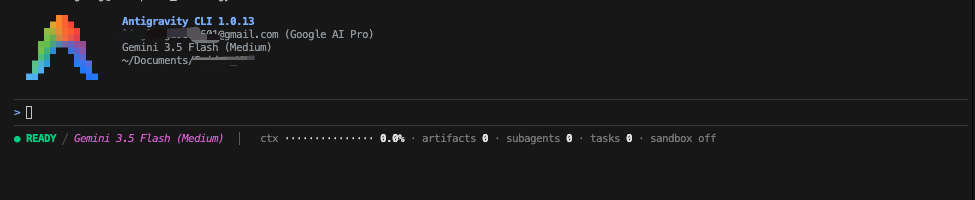
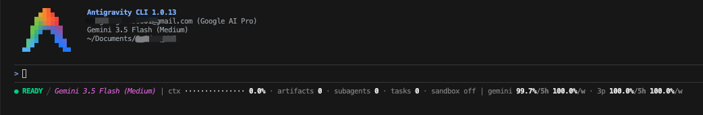
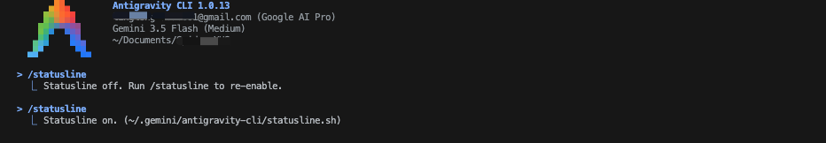

# Antigravity CLI Statusline 自定义

## Statusline 是什么？

官方对 statusline 的解释是：

> 切换标准状态栏组件，定义自定义脚本配置，并格式化动态 JSON 状态载荷。
>
> 状态栏位于 TUI 提示面板的底部。它会提供一眼可见的上下文信息，包括当前活跃的 agent 循环、工作区环境、上下文 token 窗口使用情况，以及后台执行任务。

用大白话说，statusline 就是 Antigravity CLI 底部那一条“实时仪表盘”。它不负责对话内容本身，而是告诉你 CLI 当前处在什么状态：模型是不是正在思考、上下文用了多少、当前在哪个 Git 分支、沙盒是否开启、后台有没有任务、quota 还剩多少。

Antigravity CLI 支持通过自定义脚本渲染 statusline。CLI 会把当前会话状态、模型、上下文窗口、版本控制、任务数量、quota 等信息以 JSON 形式传给脚本，脚本再把这些字段格式化成终端里显示的状态栏。

本目录提供两个脚本：

### [`statusline.sh`](https://github.com/google-antigravity/antigravity-cli/blob/main/examples/statusline/statusline.sh)：官方示例脚本

`statusline.sh` 是官方提供的示例脚本，它会显示 agent 状态、模型、Git 分支、上下文使用率、artifacts、subagents、tasks 和 sandbox 状态。下图为运行效果：



### `statusline_with_quota.sh`：优化版本

`statusline_with_quota.sh` 是在官方示例基础上的个人优化版本。它保留基础状态信息，同时额外读取 quota 字段，显示 Gemini 和第三方模型的 5 小时、周额度剩余比例。



这个版本适合日常使用：你不需要频繁手动运行 `/context` 查看上下文，也不需要反复运行 `/usage` 查看额度概况，底部 statusline 会直接给出一份简略信息。完整细节仍然可以继续用 `/context` 和 `/usage` 查看。

## 使用方法

如果你选择使用优化版 `statusline_with_quota.sh`，可以将下面第一步下载安装命令替换为下面的命令即可

```bash
curl -L https://github.com/warriors1989/antigravity-tutorial/blob/29da2d58c454a64ab4fbabd54a02680035f1eb98/antigrivity-cli/Customizations/status-line/statusline_with_quota.sh -o ~/.gemini/antigravity-cli/statusline.sh
```

## 运行原理

官方对自定义 statusline 的工作机制解释如下：

> Whenever the agent state changes, the TUI executes your command script, pipes a detailed state JSON payload directly to the script's stdin, reads your formatted string from stdout, and renders the result in the prompt's status line. Full ANSI color codes are supported.

用大白话说就是：**CLI 把当前会话的完整状态打包成一份 JSON，通过标准输入（stdin）塞给你的脚本；你的脚本想怎么排版就怎么排版，往标准输出（stdout）打印一行字符串；CLI 拿到这行字符串，直接渲染到提示面板底部的状态栏里。支持 ANSI 颜色代码，所以你可以给不同字段上色。**

CLI 传进来的 JSON 长这样（只列主要字段）：

```json
{
  "agent_state": "idle",
  "model": {
    "id": "Gemini",
    "display_name": "Gemini"
  },
  "context_window": {
    "total_input_tokens": 88244,
    "total_output_tokens": 61074,
    "context_window_size": 1048576,
    "used_percentage": 8.4,
    "remaining_percentage": 91.6
  },
  "vcs": {
    "type": "git",
    "branch": "dev",
    "dirty": false
  },
  "sandbox": {
    "enabled": false
  },
  "plan_tier": "Pro",
  "terminal_width": 111
}
```

脚本拿到这份 JSON 后，用 `jq` 从中提取需要的字段，拼成一行格式化文本输出——这就是你在状态栏里看到的内容。你完全可以根据这份 JSON 自由定制显示内容和样式。


## 安装步骤
### 第一步：下载官方示例脚本

首先下载官方提供的 [`statusline.sh`](https://github.com/google-antigravity/antigravity-cli/blob/main/examples/statusline/statusline.sh) 脚本，放到~/.gemini/antigravity-cli目录下

可以直接运行下面的命令下载脚本：

```bash
curl -L https://raw.githubusercontent.com/google-antigravity/antigravity-cli/refs/heads/main/examples/statusline/statusline.sh -o ~/.gemini/antigravity-cli/statusline.sh
```

### 第二步：给脚本添加执行权限

下载完成后，需要给 `statusline.sh` 添加执行权限，否则 Antigravity CLI 无法把它当作可执行脚本运行。

```bash
chmod +x ~/.gemini/antigravity-cli/statusline.sh
```

### 第三步：配置 statusline 命令

打开 Antigravity CLI 的全局配置文件：

```text
vim ~/.gemini/antigravity-cli/settings.json
```

在配置文件里添加 `statusLine` 配置：

```json
{
  "statusLine": {
    "enabled": true,
    "type": "command",
    "command": "~/.gemini/antigravity-cli/statusline.sh"
  }
}
```

这里的 `"enabled": true` 表示默认开启 statusline。如果你暂时不想显示，可以把它改成 `false`。

也可以不用反复改配置文件，直接在 Antigravity CLI 里运行：

```text
/statusline
```

这个命令会在 `on` 和 `off` 之间切换 statusline。关闭后再次运行 `/statusline`，就会重新开启。



如果你的 `settings.json` 里已经有其他配置，不要直接覆盖整个文件，只需要把 `statusLine` 这一段合并进去。

---

## ⚠️ 第四步（必读）：状态栏显示默认值，不是真实值？

配置完成后，如果状态栏一直显示固定的默认值（比如 agent 状态始终是 `idle`、上下文始终是 `0%`、模型名称为空等），**而不是跟随实际运行状态变化**，那 100% 的原因是系统没有安装 `jq` 命令。

可以先快速验证一下：

```bash
jq --version
```

如果提示 `command not found: jq` 或类似错误，说明系统没有安装 `jq`，往下看解决方法。

### 为什么？

`statusline.sh` 脚本的核心逻辑在第 46 行——通过 `jq` 解析 Antigravity CLI 传过来的 JSON 状态载荷，从中提取 agent 状态、上下文使用率、Git 分支、模型名称等所有动态字段。

```bash
# 脚本第 46 行（关键行）
jq -r '
  (.agent_state // "idle"),
  (.context_window.used_percentage // 0),
  ...
' 2>/dev/null || printf "idle\n0\n\nfalse\nfalse\n0\n0\n0\n\n80\n"
```

当 `jq` 不存在时，`jq` 命令执行失败，脚本会触发 `||` 后面的 fallback（回退），直接输出一串硬编码默认值（`idle`、`0`、`""`、`false`……）。**这就是状态栏看起来正常显示，但永远不变的根本原因。**

### 解决方法

安装 `jq` 即可。macOS 和 Linux 的安装方式：

```bash
# macOS（使用 Homebrew）
brew install jq

# Ubuntu / Debian
sudo apt install jq

# CentOS / RHEL / Fedora
sudo yum install jq

# Windows（使用 winget 或 Chocolatey）
winget install jq
choco install jq
```

### 验证是否安装

```bash
which jq      # 应该输出路径，如 /usr/local/bin/jq
jq --version  # 应该输出版本号，如 jq-1.7.1
```

> 💡 补充说明：示例脚本的 `2>/dev/null` 把 `jq` 的错误信息吞掉了，所以没有 jq 时不会有任何报错提示，只会静默显示默认值——这也是这个 bug 容易被忽略的原因。
